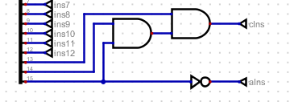
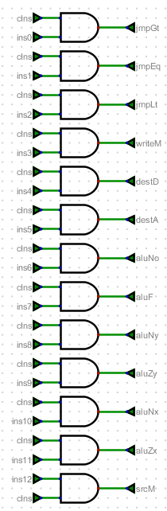
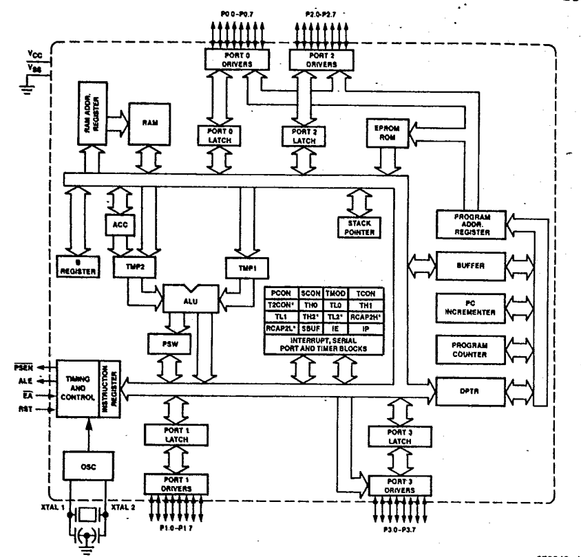

# Unidad 1
# Definiciones de Términos

1. **CPU (Central Processing Unit)**: 
   La CPU es el cerebro de la computadora, responsable de ejecutar instrucciones y realizar cálculos. Coordina y controla todas las operaciones del sistema, tomando instrucciones de la memoria, interpretándolas y ejecutándolas.

2. **ALU (Arithmetic Logic Unit)**: 
   La ALU es una parte fundamental de la CPU que realiza operaciones aritméticas (suma, resta, multiplicación, división) y lógicas (AND, OR, NOT) sobre los datos.

3. **Registros**:
    1. **Registros de propósito general**: 
       Son registros dentro de la CPU que pueden ser utilizados para almacenar datos temporales durante el procesamiento. Son flexibles y pueden ser utilizados para diversas operaciones.
    2. **Registros específicos**: 
       Son registros con funciones definidas, como:
        - **Program Counter (PC)**: 
          Almacena la dirección de la próxima instrucción a ser ejecutada.
        - **Stack Pointer (SP)**: 
          Apunta a la parte superior de la pila (stack), una estructura de datos utilizada para gestionar llamadas a funciones y almacenamiento temporal de datos.

4. **Unidad de control**: 
   Esta unidad dentro de la CPU gestiona y coordina todas las operaciones de la computadora. Interpreta las instrucciones de la memoria y genera señales de control para dirigir el flujo de datos y las operaciones de la ALU, los registros y otros componentes.

5. **Buses de datos y de dirección**: 
   Los buses son canales de comunicación que permiten el transporte de datos entre los diferentes componentes de la computadora.
    - **Bus de datos**: 
      Transporta datos entre la CPU, la memoria y otros dispositivos.
    - **Bus de dirección**: 
      Transporta las direcciones de memoria a las que la CPU quiere acceder para leer o escribir datos.

6. **Memoria**: 
   La memoria de una computadora almacena datos e instrucciones necesarias para el funcionamiento del sistema. Hay diferentes tipos de memoria, como la RAM (memoria de acceso aleatorio) para almacenamiento temporal y la ROM (memoria de solo lectura) para almacenar instrucciones permanentes.

7. **Opcode**: 
   Un opcode (código de operación) es una parte de una instrucción en lenguaje máquina que especifica la operación a realizar. Es la porción de la instrucción que indica a la CPU qué acción tomar, como sumar, cargar datos, almacenar datos, etc.

## Fuentes
- **Computer Science: An Overview** by J. Glenn Brookshear.
- **Computer Organization and Design** by David A. Patterson and John L. Hennessy.
- **Operating Systems: Internals and Design Principles** by William Stallings.
- **Computer Architecture: A Quantitative Approach** by John L. Hennessy and David A. Patterson.

# Ejercicio 2
La CPU de la computadora se encarga de la decodificación de las instrucciones específicas del programa y del procesamiento de datos.

 La memoria ROM almacena el programa a ser ejecutado. Ésta cuenta con dos registros: el registro de las direcciones y el de datos. 

 También se cuenta con periféricos de entrada (teclado) y de salida (pantalla). Estos elementos están conectados a un elemento adicional de memoria para guardar sus datos de operación.

 Igualmente, se cuenta con una señal de reloj (clock) para sincronizar las acciones del circuito. 

 # Ejercicio 4
El proceso *fetch-decode-execute* consiste de tres etapas que la CPU ejecuta cíclicamente. Primero, en la etapa *fetch*, el microprocesador recupera una instrucción de la memoria, haciendo uso del PC (Contador de Programa) para obtener la dirección de la siguiente instrucción que se ejecutará. Seguidamente, en la etapa *decode*, se interpreta la instrucción obtenida, identificando el operador y operando, según sea el caso. Por último, en la etapa de *execute*, el microprocesador realiza la operación que le fue encomendada. Luego de completar este procedimiento, el ciclo comienza de nuevo con la siguiente instrucción, continuando haste que se detenga el programa.

# Ejercicio 6
El procesador del caso en estudio cuenta con instrucciones tipo A y C. El primer tipo especifica la dirección de memoria donde están almacenados los datos con los que se va a trabajar, o donde se almacerán los resultados de cierta operación. 

Por su parte, las instrucciones tipo C determinan las operaciones a ser realizadas por la CPU y la manera en que éstas han de ser implementadas. Adicionalmente, pueden controlar el flujo de control del programa con instrucción de salto.

A manera de ejemplo, supóngase que se desea adicionar un número al acumulador de la ALU. Con tal propósito deberá utilizarse una instrucción tipo C que especifique la tarea correspondiente a la adición, en conjunto con una instrucción tipo A para determinar la dirección del operando a ser procesado.

# Ejercicio 7

La imagen muestra el circuito lógico que permite discernir entre las instrucciones tipo A y tipo C. Para el caso de una instrucción tipo A, el bit 15 estará en ALT y, por tanto, la compuerta negadora generará una salida en ALTO correspondiente a la correcta identificación de una instrucción tipo A.

Por otra parte, cuando la instrucción es tipo C los bits 13, 14 y 15 estarán en alto haciendo que las compuertas AND tengan salidas en ALTO, generando un ALTO que corresponde a la identificación de una instrucción C. Nótese que la salida de la negadora estará en BAJO, lo cual significa que no se trata de una instrucción A.

En la imagen anterior se observa el registro A de la CPU. El bit "destA" indica si se va a almacenar un dato en el registro A. Por tanto, cuando dicho bit está en ALTO, se activa el enable del registro, permitiendo el almacenamiento de un bit. En cuanto al multiplexor, el bit "ins" es seleccionado cuando la instrucción es tipo A (aIns está en ALTO). En esas circunstacias, se almacena el bit ins en el registro A.

En la anterior imagen se observa un conjunto de compuertas AND que involucran los bits 0-12, que corresponden a los bits de instrucciones tipo C, por lo cual las compuertas sólo se activarán cuando cIns esté en ALTO.

# Ejercicio 9
A continuación se describe el programa Assembler línea por línea:

        @i : Carga la dirección de la variable i en el registro A 
        M=1 : Guarda el valor 1 en la dirección correspondiente a i

        @sum : Carga la dirección de la variable sum en el registro A
        M=0 : Guarda el valor 0 en la dirección correspondiente a sum
        
        @100 : Almacena la constante 100 en el registro A
        D=A : Transfiere la constante 100 del registro A al registro D

        @i : Carga la dirección de la variable i en el registro A
        D=D-M : Resta el valor de i a D (100), calculando 100 - i
        
        @END : Carga la dirección correspondiente a la etiqueta END en el registro A
        D;JLE : Se salta a END si D es menor o igual a cero, lo cual equivale a i = 100

        @i : Carga la dirección de la variable i en el registro A
        D=M : Transfiere el valor de i al registro D 

        @sum : Carga la dirección de la variable sum en el registro A
        M=M+D : Suma el valor del registro D al de sum

        @i : Carga la dirección de la variable i en el registro A
        M=M+1 : Incrementa el valor de i en 1

        @4 : Carga la dirección 4 en el registro A
        0;JMP : Salta a la instrucción en la dirección 4, la cual corresponde a @100

(END) : Define la etiqueta END
        @END : Carga la dirección correspondiente a la etiqueta END
        0;JMP : Salta a la dirección de END, creando un bucle infinito

En su conjunto, el programa suma los números del 1 al 99. El valor se encuentra en la variable sum.

# Actividad 2 - Mapa de memoria y set de instrucciones

## Resumen del Contenido Teórico

### Mapa de Memoria

#### Definición
El mapa de memoria es un esquema que muestra cómo se organizan y asignan las direcciones de memoria en un sistema computacional. Esto incluye la distribución de la memoria RAM, ROM, memoria caché y dispositivos periféricos.

#### Componentes
1. **Memoria RAM:** Utilizada para almacenar datos temporales y variables durante la ejecución de programas.
2. **Memoria ROM:** Contiene instrucciones permanentes y esenciales para el funcionamiento del sistema.
3. **Memoria Caché:** Memoria de alta velocidad que almacena copias de datos frecuentemente utilizados para acelerar el acceso.

#### Importancia
El mapa de memoria es crucial para comprender cómo el procesador accede y gestiona los datos. Facilita la optimización del rendimiento del sistema y la detección de errores.

### Set de Instrucciones

#### Definición
El set de instrucciones es el conjunto de comandos que un procesador puede ejecutar. Estas instrucciones son fundamentales para realizar operaciones en la computadora.

#### Tipos de Instrucciones
1. **Instrucciones Aritméticas:** Incluyen operaciones como suma, resta, multiplicación y división.
2. **Instrucciones Lógicas:** Comprenden operaciones como AND, OR, NOT y XOR.
3. **Instrucciones de Control de Flujo:** Permiten la ejecución de saltos, bucles y llamadas a subrutinas.
4. **Instrucciones de Transferencia de Datos:** Manejan el movimiento de datos entre registros y memoria.

#### Formato de Instrucción
Las instrucciones suelen estar compuestas por un código de operación (opcode) y operandos. El opcode especifica la operación a realizar, mientras que los operandos indican los datos o la ubicación de los datos sobre los cuales operar.

### Arquitectura del Procesador

#### Arquitectura CISC
La arquitectura CISC (Complex Instruction Set Computer) incluye instrucciones complejas que pueden realizar múltiples operaciones con una sola instrucción. Este enfoque puede reducir la cantidad de instrucciones necesarias para realizar una tarea, pero puede ser menos eficiente en términos de ciclos de reloj.

#### Arquitectura RISC
La arquitectura RISC (Reduced Instruction Set Computer) se basa en instrucciones simples y rápidas que pueden ejecutarse en un solo ciclo de reloj. Este diseño facilita la optimización del rendimiento y la implementación del hardware.

### Comparación de Microprocesadores

#### Ejemplos de Procesadores
1. **Intel 8086:** Procesador clásico de 16 bits utilizado en computadoras personales.
2. **ARM Cortex-M4:** Procesador RISC utilizado en sistemas embebidos.
3. **MIPS R3000:** Procesador utilizado en estaciones de trabajo y servidores.

#### Parámetros de Comparación
1. **Longitud de Instrucción:** Medida en bits, indica el tamaño de cada instrucción.
2. **Ciclos de Reloj:** Número de ciclos de reloj necesarios para ejecutar una instrucción.
3. **Complejidad:** Evalúa la facilidad de implementación y la eficiencia de las instrucciones.

# Investigación del Procesador: Intel 8051

## Arquitectura del Intel 8051

- **Bits:** 8 bits.
- **Registros:** El 8051 cuenta con varios registros, incluyendo el acumulador (A), el registro B, el contador de programa (PC), el puntero de datos (DPTR) y los registros de propósito general divididos en cuatro bancos de registro.
- **Memoria:** Soporta hasta 64 KB de memoria de programa y 64 KB de memoria de datos.
- **Instrucciones:** Utiliza un set de instrucciones CISC (Complex Instruction Set Computer) con 111 instrucciones, que incluyen operaciones aritméticas, lógicas, de control y de transferencia de datos.
- **Puertos I/O:** Dispone de cuatro puertos de entrada/salida de 8 bits cada uno, que pueden ser utilizados para conectar periféricos externos.

## Mapa de Memoria del Intel 8051

El mapa de memoria del Intel 8051 está dividido en varias áreas, tanto para la memoria de programa como para la memoria de datos.

### Memoria de Programa
- **Espacio de Memoria:** 64 KB.
- **Direcciones:** Desde 0x0000 hasta 0xFFFF.
- **ROM Interna:** En muchos diseños, el 8051 incluye 4 KB de ROM interna que se utiliza para almacenar el programa. Los primeros 4 KB de la memoria de programa (0x0000 a 0x0FFF) están normalmente ocupados por esta ROM interna.

### Memoria de Datos
- **Espacio de Memoria:** 64 KB.
- **Direcciones:** Desde 0x0000 hasta 0xFFFF.
- **RAM Interna:** El 8051 tiene 128 bytes de RAM interna dividida en varias áreas:
  - **Registro de Propósito General:** 32 bytes, organizados en cuatro bancos de registro (R0 a R7).
  - **Memoria Bit-Addressable:** 16 bytes, permitiendo acceso a nivel de bit.
  - **Memoria de Propósito General:** 80 bytes, utilizados para almacenamiento de datos temporales.
- **RAM Externa:** Puede acceder hasta 64 KB de RAM externa a través de los pines externos.

### Puertos de Entrada/Salida (I/O)
- **Puertos:** Cuatro puertos (P0 a P3), cada uno de 8 bits.
- **Direcciones de Puertos:**
  - **P0:** 0x80 a 0x87
  - **P1:** 0x90 a 0x97
  - **P2:** 0xA0 a 0xA7
  - **P3:** 0xB0 a 0xB7

## Ejemplo de Distribución de la Memoria

A continuación, se muestra una distribución típica del mapa de memoria del Intel 8051:

- **0x0000 - 0x0FFF:** Memoria de Programa (ROM Interna)
- **0x1000 - 0xFFFF:** Memoria de Programa Externa
- **0x0000 - 0x007F:** RAM Interna
  - **0x00 - 0x1F:** Registros de Propósito General
  - **0x20 - 0x2F:** Memoria Bit-Addressable
  - **0x30 - 0x7F:** Memoria de Propósito General
- **0x8000 - 0xFFFF:** RAM Externa
- **0x80 - 0xB7:** Puertos de I/O

## Fuente: 
* *[Hoja de datos Intel 8051](https://www.keil.com/dd/docs/datashts/intel/80xxah_ds.pdf)*

## Comparación de Instrucciones

### Intel 8051

| Instrucción  | Longitud (bits) | Ciclos de Reloj | Complejidad | Descripción                                    |
|--------------|------------------|-----------------|-------------|------------------------------------------------|
| MOV A, #data | 16               | 2               | Baja        | Carga inmediata de un valor en el acumulador   |
| ADD A, R0    | 8                | 1               | Baja        | Suma el contenido del registro R0 al acumulador|
| SJMP addr    | 16               | 2               | Media       | Salto corto a la dirección especificada        |

### Atmel AVR ATmega328P

| Instrucción  | Longitud (bits) | Ciclos de Reloj | Complejidad | Descripción                                    |
|--------------|------------------|-----------------|-------------|------------------------------------------------|
| LDI R16, 0xFF| 16               | 1               | Baja        | Carga inmediata en el registro R16             |
| ADD R16, R17 | 16               | 1               | Baja        | Suma los registros R16 y R17                   |
| RJMP k       | 16               | 2               | Media       | Salto relativo a la dirección especificada     |

### Microchip PIC16F84A

| Instrucción  | Longitud (bits) | Ciclos de Reloj | Complejidad | Descripción                                    |
|--------------|------------------|-----------------|-------------|------------------------------------------------|
| MOVLW 0xFF   | 14               | 1               | Baja        | Carga inmediata en el registro de trabajo (WREG)|
| ADDWF 0x20, W| 14               | 1               | Baja        | Suma el registro de trabajo (WREG) con el registro |
| GOTO addr    | 14               | 2               | Media       | Salto a la dirección especificada              |

## Fuentes: 
* *[Hoja de datos Intel 8051](https://www.keil.com/dd/docs/datashts/intel/80xxah_ds.pdf)*
* *[Hoja de datos ATmega328P](https://ww1.microchip.com/downloads/en/DeviceDoc/Atmel-7810-Automotive-Microcontrollers-ATmega328P_Datasheet.pdf)*
* *[Hoja de datos PIC16F84A](https://ww1.microchip.com/downloads/en/DeviceDoc/35007b.pdf)*

