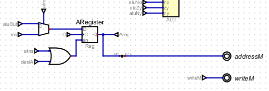

# Unidad 1
# Definiciones de Términos

1. **CPU (Central Processing Unit)**: 
   La CPU es el cerebro de la computadora, responsable de ejecutar instrucciones y realizar cálculos. Coordina y controla todas las operaciones del sistema, tomando instrucciones de la memoria, interpretándolas y ejecutándolas.

2. **ALU (Arithmetic Logic Unit)**: 
   La ALU es una parte fundamental de la CPU que realiza operaciones aritméticas (suma, resta, multiplicación, división) y lógicas (AND, OR, NOT) sobre los datos.

3. **Registros**:
    1. **Registros de propósito general**: 
       Son registros dentro de la CPU que pueden ser utilizados para almacenar datos temporales durante el procesamiento. Son flexibles y pueden ser utilizados para diversas operaciones.
    2. **Registros específicos**: 
       Son registros con funciones definidas, como:
        - **Program Counter (PC)**: 
          Almacena la dirección de la próxima instrucción a ser ejecutada.
        - **Stack Pointer (SP)**: 
          Apunta a la parte superior de la pila (stack), una estructura de datos utilizada para gestionar llamadas a funciones y almacenamiento temporal de datos.

4. **Unidad de control**: 
   Esta unidad dentro de la CPU gestiona y coordina todas las operaciones de la computadora. Interpreta las instrucciones de la memoria y genera señales de control para dirigir el flujo de datos y las operaciones de la ALU, los registros y otros componentes.

5. **Buses de datos y de dirección**: 
   Los buses son canales de comunicación que permiten el transporte de datos entre los diferentes componentes de la computadora.
    - **Bus de datos**: 
      Transporta datos entre la CPU, la memoria y otros dispositivos.
    - **Bus de dirección**: 
      Transporta las direcciones de memoria a las que la CPU quiere acceder para leer o escribir datos.

6. **Memoria**: 
   La memoria de una computadora almacena datos e instrucciones necesarias para el funcionamiento del sistema. Hay diferentes tipos de memoria, como la RAM (memoria de acceso aleatorio) para almacenamiento temporal y la ROM (memoria de solo lectura) para almacenar instrucciones permanentes.

7. **Opcode**: 
   Un opcode (código de operación) es una parte de una instrucción en lenguaje máquina que especifica la operación a realizar. Es la porción de la instrucción que indica a la CPU qué acción tomar, como sumar, cargar datos, almacenar datos, etc.

## Fuentes
- **Computer Science: An Overview** by J. Glenn Brookshear.
- **Computer Organization and Design** by David A. Patterson and John L. Hennessy.
- **Operating Systems: Internals and Design Principles** by William Stallings.
- **Computer Architecture: A Quantitative Approach** by John L. Hennessy and David A. Patterson.

# Ejercicio 2
La CPU de la computadora se encarga de la decodificación de las instrucciones específicas del programa y del procesamiento de datos.

 La memoria ROM almacena el programa a ser ejecutado. Ésta cuenta con dos registros: el registro de las direcciones y el de datos. 

 También se cuenta con periféricos de entrada (teclado) y de salida (pantalla). Estos elementos están conectados a un elemento adicional de memoria para guardar sus datos de operación.

 Igualmente, se cuenta con una señal de reloj (clock) para sincronizar las acciones del circuito. 

 # Ejercicio 4
El proceso *fetch-decode-execute* consiste de tres etapas que la CPU ejecuta cíclicamente. Primero, en la etapa *fetch*, el microprocesador recupera una instrucción de la memoria, haciendo uso del PC (Contador de Programa) para obtener la dirección de la siguiente instrucción que se ejecutará. Seguidamente, en la etapa *decode*, se interpreta la instrucción obtenida, identificando el operador y operando, según sea el caso. Por último, en la etapa de *execute*, el microprocesador realiza la operación que le fue encomendada. Luego de completar este procedimiento, el ciclo comienza de nuevo con la siguiente instrucción, continuando haste que se detenga el programa.

# Ejercicio 6
El procesador del caso en estudio cuenta con instrucciones tipo A y C. El primer tipo especifica la dirección de memoria donde están almacenados los datos con los que se va a trabajar, o donde se almacerán los resultados de cierta operación. 

Por su parte, las instrucciones tipo C determinan las operaciones a ser realizadas por la CPU y la manera en que éstas han de ser implementadas. Adicionalmente, pueden controlar el flujo de control del programa con instrucción de salto.

A manera de ejemplo, supóngase que se desea adicionar un número al acumulador de la ALU. Con tal propósito deberá utilizarse una instrucción tipo C que especifique la tarea correspondiente a la adición, en conjunto con una instrucción tipo A para determinar la dirección del operando a ser procesado.

# Ejercicio 7

La imagen muestra el circuito lógico que permite discernir entre las instrucciones tipo A y tipo C. Para el caso de una instrucción tipo A, el bit 15 estará en ALT y, por tanto, la compuerta negadora generará una salida en ALTO correspondiente a la correcta identificación de una instrucción tipo A.

Por otra parte, cuando la instrucción es tipo C los bits 13, 14 y 15 estarán en alto haciendo que las compuertas AND tengan salidas en ALTO, generando un ALTO que corresponde a la identificación de una instrucción C. Nótese que la salida de la negadora estará en BAJO, lo cual significa que no se trata de una instrucción A.

En la imagen anterior se observa el registro A de la CPU. El bit "destA" indica si se va a almacenar un dato en el registro A. Por tanto, cuando dicho bit está en ALTO, se activa el enable del registro, permitiendo el almacenamiento de un bit. En cuanto al multiplexor, el bit "ins" es seleccionado cuando la instrucción es tipo A (aIns está en ALTO). En esas circunstacias, se almacena el bit ins en el registro A.

En la anterior imagen se observa un conjunto de compuertas AND que involucran los bits 0-12, que corresponden a los bits de instrucciones tipo C, por lo cual las compuertas sólo se activarán cuando cIns esté en ALTO.

# Ejercicio 9
A continuación se describe el programa Assembler línea por línea:

        @i : Carga la dirección de la variable i en el registro A 
        M=1 : Guarda el valor 1 en la dirección correspondiente a i

        @sum : Carga la dirección de la variable sum en el registro A
        M=0 : Guarda el valor 0 en la dirección correspondiente a sum
        
        @100 : Almacena la constante 100 en el registro A
        D=A : Transfiere la constante 100 del registro A al registro D

        @i : Carga la dirección de la variable i en el registro A
        D=D-M : Resta el valor de i a D (100), calculando 100 - i
        
        @END : Carga la dirección correspondiente a la etiqueta END en el registro A
        D;JLE : Se salta a END si D es menor o igual a cero, lo cual equivale a i = 100

        @i : Carga la dirección de la variable i en el registro A
        D=M : Transfiere el valor de i al registro D 

        @sum : Carga la dirección de la variable sum en el registro A
        M=M+D : Suma el valor del registro D al de sum

        @i : Carga la dirección de la variable i en el registro A
        M=M+1 : Incrementa el valor de i en 1

        @4 : Carga la dirección 4 en el registro A
        0;JMP : Salta a la instrucción en la dirección 4, la cual corresponde a @100

(END) : Define la etiqueta END
        @END : Carga la dirección correspondiente a la etiqueta END
        0;JMP : Salta a la dirección de END, creando un bucle infinito

En su conjunto, el programa suma los números del 1 al 99. El valor se encuentra en la variable sum.

